# 🧭 Guía Paso a Paso: Arquitectura Actual del Sistema con el Modelo C4

Esta guía complementa el `README.md` del taller. Cubre los dos entregables de la Parte 1 y la Parte 2: la **vista de contexto (C1)** y la **vista de contenedores (C2)** del modelo C4, ambas construidas sobre el caso base de RedExpress.

Los diagramas de ejemplo de esta guía están escritos en [Mermaid](https://mermaid.js.org/) y se renderizan automáticamente al ver este archivo en GitHub. Úselos como referencia de método — el entregable final debe hacerse en draw.io o Astah UML según lo indicado en el `README.md`.

---

## Parte A — Vista de Contexto (C1)

### A.1 Leyenda de notación C1

| Elemento | Forma / color | Uso |
|---|---|---|
| Persona (actor) | Óvalo azul | Alguien que interactúa directamente con el sistema |
| Sistema en alcance | Rectángulo azul oscuro | El sistema que se está documentando (una sola caja, sin desglosar) |
| Sistema externo | Rectángulo gris de doble borde | Sistema de un tercero, fuera del control del equipo |
| Relación | Flecha etiquetada | Qué información o función se intercambia, con verbo explícito |

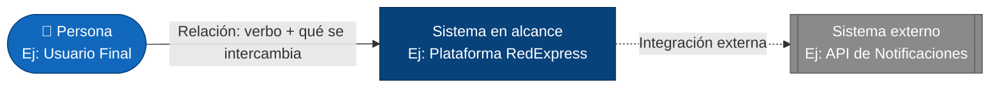

### A.2 Metodología en 4 pasos

1. **Identificar actores** — liste las personas o roles que interactúan directamente con el sistema.
2. **Identificar el sistema en alcance y los sistemas externos** — dibuje el sistema que se está documentando como una sola caja, y ubique aparte los sistemas de terceros con los que se conecta.
3. **Trazar relaciones** — conecte cada actor y cada sistema externo con el sistema en alcance, según quién interactúa con quién.
4. **Etiquetar relaciones y validar** — indique qué se intercambia en cada relación y confirme que ningún actor o sistema quede sin conexión.

### A.3 Ejemplo guiado: Contexto de RedExpress

#### Paso 1 — Identificar actores

Del caso base se extraen los tres actores humanos: **Usuario Final** (rastrea sus envíos), **Mensajero** (actualiza el estado de las entregas) y **Operador Logístico** (gestiona rutas y despachos).

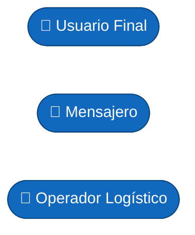

#### Paso 2 — Identificar el sistema en alcance y los sistemas externos

Se dibuja **Plataforma RedExpress** como el sistema en alcance (una sola caja, sin desglosar sus módulos internos todavía) y se identifican dos sistemas externos con los que se integra: la **API de Notificaciones** y el **Proveedor de Geolocalización**, ambos servicios de terceros.

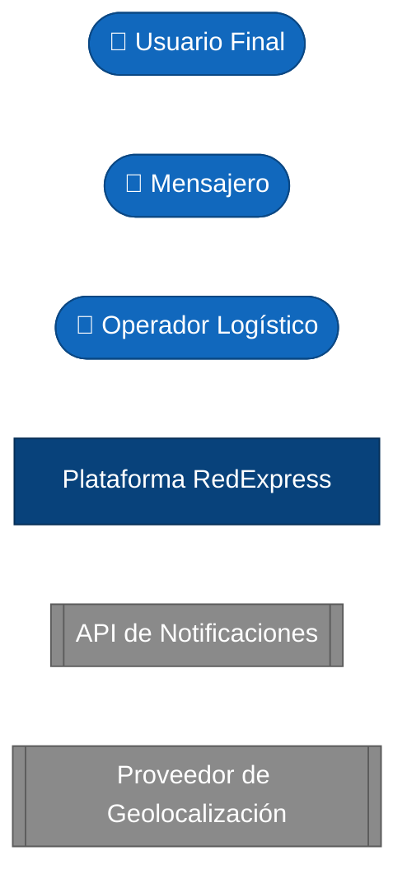

#### Paso 3 — Trazar relaciones

Se conecta cada actor con la plataforma y la plataforma con cada sistema externo. En este paso todavía no se explica qué viaja por cada relación — solo se establece quién se conecta con quién.

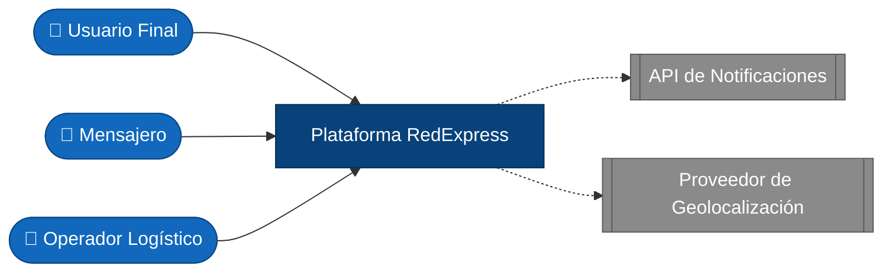

#### Paso 4 — Etiquetar relaciones y validar

Se etiqueta cada flecha con el verbo y la información que se intercambia. El diagrama queda validado cuando cada actor y cada sistema externo tiene una relación clara con la plataforma.

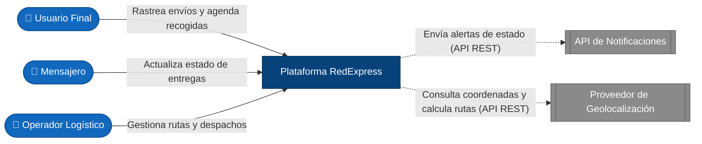

### A.4 Errores comunes en C1

| Error frecuente | Por qué es un problema | Cómo corregirlo |
|---|---|---|
| Dibujar los contenedores internos (apps, servicios) directamente en el C1 | Mezcla dos niveles de abstracción distintos | Deje los contenedores para el C2; en el C1 el sistema en alcance es una sola caja |
| No distinguir sistemas externos de sistemas propios | El lector no puede saber qué está bajo control del equipo y qué es de un proveedor | Use una forma/color distinto para sistemas externos (ver leyenda) |
| Relaciones sin etiqueta | No se entiende qué información o función se intercambia | Etiquete cada flecha con un verbo + qué se intercambia |
| Incluir actores sin relación directa con el sistema | Satura el diagrama con información irrelevante para este nivel | Solo incluya actores con una relación directa y relevante |

---

## Parte B — Vista de Contenedores (C2)

### B.1 Leyenda de notación C2

| Elemento | Forma / color | Uso |
|---|---|---|
| Contenedor | Rectángulo azul claro | Una aplicación o servicio desplegable dentro del sistema, con su tecnología indicada |
| Infraestructura de soporte | Rectángulo/cilindro gris | Base de datos, balanceador u otro componente que da soporte a los contenedores |
| Relación | Flecha etiquetada | Protocolo o mecanismo de comunicación entre contenedores (REST, SQL, WebSocket, etc.) |

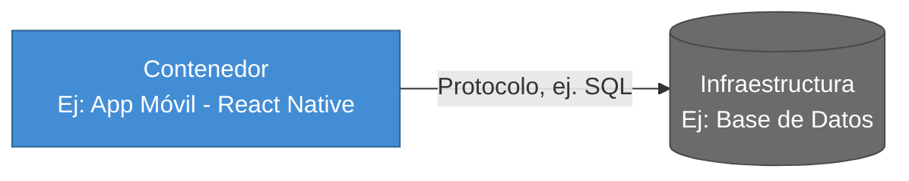

### B.2 Metodología en 4 pasos

1. **Descomponer el sistema en contenedores** — divida el sistema en alcance del C1 en las aplicaciones y servicios que realmente lo componen.
2. **Ubicar la infraestructura de soporte** — agregue los componentes compartidos (bases de datos, balanceadores) de los que dependen los contenedores.
3. **Trazar relaciones** — conecte los contenedores entre sí y con los actores/sistemas externos ya identificados en el C1.
4. **Etiquetar tecnología y protocolo, y validar** — indique con qué protocolo se comunica cada relación y confirme que cada contenedor tenga una responsabilidad clara y distinta de las demás.

### B.3 Ejemplo guiado: Contenedores de RedExpress

#### Paso 1 — Descomponer el sistema en contenedores

La **Plataforma RedExpress** del C1 se descompone en sus aplicaciones y servicios: **App Móvil**, **Portal Web Operadores**, **Módulo de Gestión de Paquetes**, **Motor de Rutas**, **Seguimiento GPS** y **Sistema de Alertas**. Aún no se conectan entre sí.

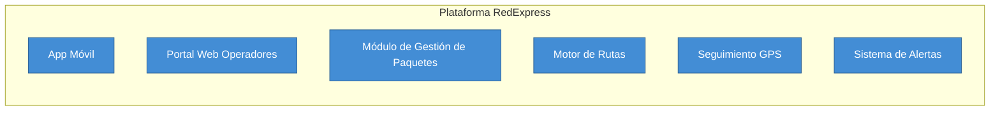

#### Paso 2 — Ubicar infraestructura de soporte

Se agregan el **Balanceador de Carga**, que distribuye el tráfico entrante, y la **Base de Datos Distribuida**, donde persiste la información de paquetes, rutas y usuarios.

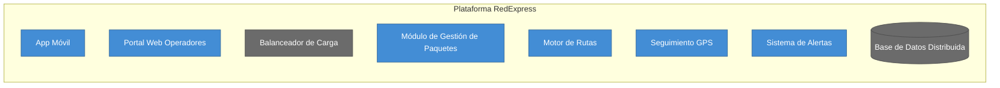

#### Paso 3 — Trazar relaciones

Se conectan los contenedores entre sí, y se retoman los actores y sistemas externos del C1 (Usuario Final, Mensajero, Operador Logístico, API de Notificaciones, Proveedor de Geolocalización) para mostrar con qué contenedor específico interactúa cada uno.

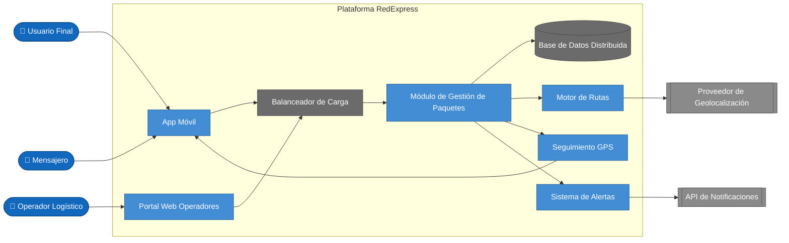

#### Paso 4 — Etiquetar tecnología/protocolo y validar

Se etiqueta cada relación con el protocolo o mecanismo de comunicación. El diagrama queda validado cuando cada contenedor tiene una responsabilidad clara y cada relación explica cómo se comunican.

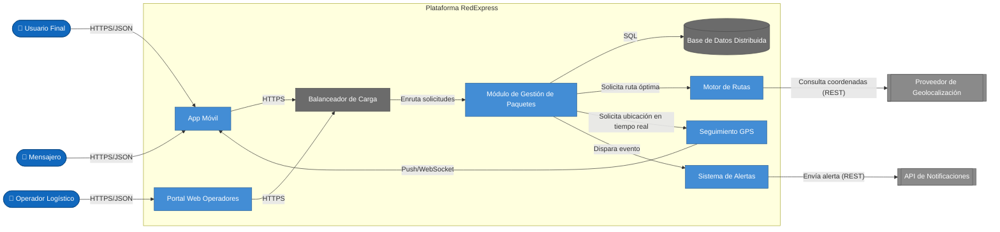

> 🖼️ Vea las dos vistas finales (C1 y C2) como un diagrama interactivo clickeable en [`clase/visualizacion-c4.html`](visualizacion-c4.html).

### B.4 Errores comunes en C2

| Error frecuente | Por qué es un problema | Cómo corregirlo |
|---|---|---|
| Contenedor sin tecnología indicada | El C2 pierde su propósito principal: mostrar decisiones tecnológicas | Indique la tecnología o el tipo de contenedor (ej. "SPA - React", "Servicio - Node.js") |
| Un solo contenedor gigante que hace de todo | Oculta la distribución real de responsabilidades del sistema | Divida por responsabilidad (gestión de paquetes, rutas, alertas, etc.) |
| Relaciones sin protocolo/tecnología | No se puede evaluar el diseño de comunicación entre contenedores | Etiquete cada relación con el protocolo (REST, SQL, WebSocket, etc.) |
| Mezclar actores del C1 con contenedores sin distinguirlos visualmente | Confunde el nivel de abstracción y quién es externo al sistema | Mantenga el estilo de nodo (persona/externo/contenedor) consistente con la leyenda |

---

## Checklist de autoevaluación antes de entregar

**Vista de Contexto (C1):**

- [ ] El sistema en alcance aparece como una única caja, sin contenedores internos visibles.
- [ ] Todos los actores relevantes están identificados y tienen al menos una relación.
- [ ] Los sistemas externos están visualmente diferenciados del sistema en alcance.
- [ ] Cada relación tiene una etiqueta que describe qué se intercambia.
- [ ] Ningún actor ni sistema queda sin conexión.

**Vista de Contenedores (C2):**

- [ ] Cada contenedor tiene su tecnología o tipo indicado.
- [ ] Los contenedores reflejan responsabilidades separadas — no hay un contenedor que "hace de todo".
- [ ] Los actores y sistemas externos del C1 se mantienen visibles y conectados en el C2.
- [ ] Cada relación entre contenedores indica el protocolo o mecanismo de comunicación.
- [ ] La infraestructura de soporte (balanceador, base de datos, integraciones) está representada.

---

## Vista ArchiMate equivalente

Los contenedores del C2 mapean casi 1:1 a **Application Components** de ArchiMate (ver la [Guía de Notación ArchiMate](https://github.com/CesarAVegaF312/AREM-ArchiMate/blob/main/guia_notacion_archimate.md)); las relaciones entre ellos usan **Serving** en vez de flechas genéricas.

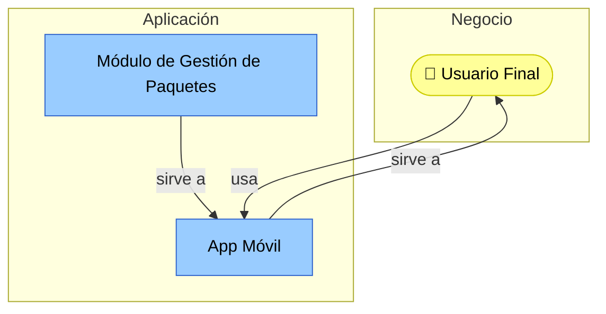

La diferencia con el C2 original: en C4 la relación se etiqueta con protocolo ("HTTPS/JSON"); en ArchiMate se etiqueta con el tipo semántico de relación (**Serving**). Ambas notaciones son válidas para el mismo contenedor — C4 responde "cómo se comunican técnicamente", ArchiMate responde "quién depende de quién en la arquitectura".

---

_Esta guía hace parte del Taller 3 de Arquitectura Actual del Sistema con el Modelo C4 — curso Arquitectura Empresarial, Universidad de La Sabana._
